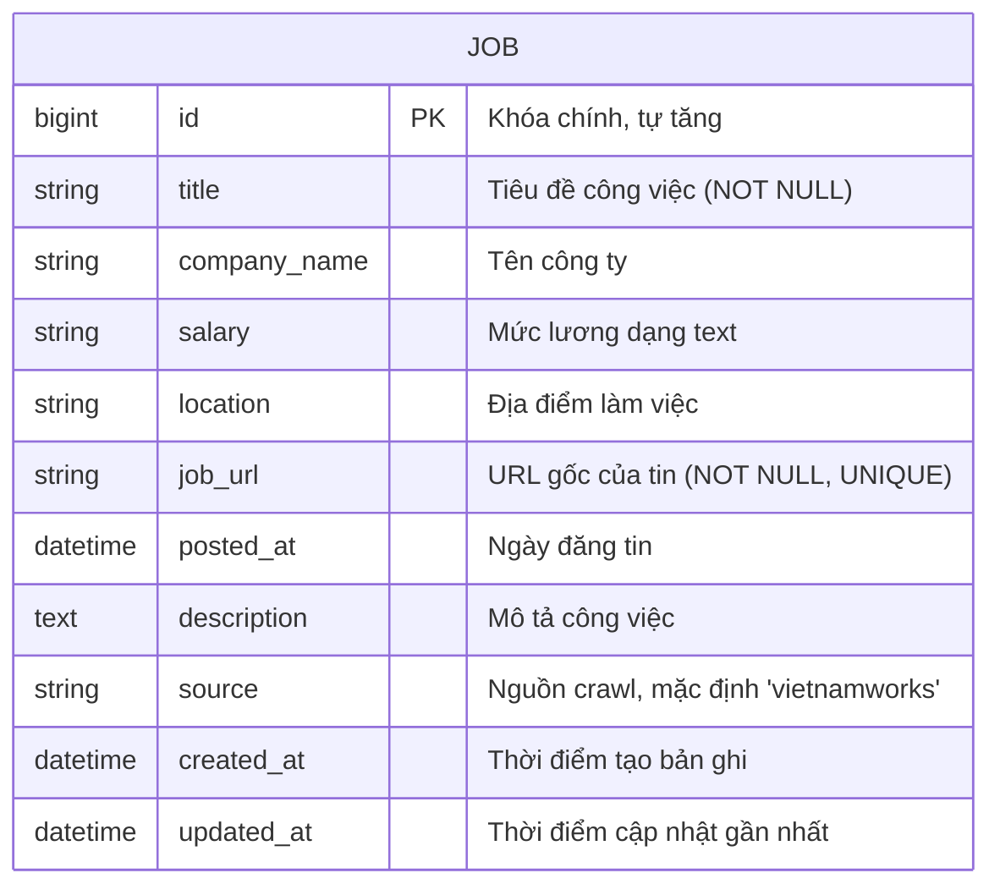

# Entity Relationship Diagram

Hệ thống hiện có một thực thể chính là `Job`, lưu mỗi tin tuyển dụng
crawl được từ VietnamWorks.

## Index

| Cột        | Loại index | Mục đích                                            |
|------------|------------|-----------------------------------------------------|
| `job_url`  | UNIQUE     | Chống trùng lặp — mỗi tin chỉ lưu một lần            |
| `location` | thường     | Tăng tốc filter theo địa điểm                        |
| `posted_at`| thường     | Tăng tốc sort theo tin mới nhất                      |
| `source`   | thường     | Lọc theo nguồn khi về sau crawl thêm nhiều nguồn     |
| `title`    | thường     | Hỗ trợ search theo tiêu đề (LIKE) khi không dùng ES  |

## Ghi chú thiết kế

Hiện tại hệ thống chỉ crawl từ một nguồn nên một bảng `jobs` là đủ.
Trường `source` được giữ lại để mở rộng: nếu sau này crawl thêm các
trang khác (TopCV, ITviec...), dữ liệu vẫn nằm chung một bảng và phân
biệt qua `source`, không cần đổi schema.

Nếu mở rộng lớn hơn, có thể tách `companies` thành bảng riêng và cho
`jobs` tham chiếu `company_id`. Ở phạm vi bài tập, lưu `company_name`
trực tiếp trong `jobs` là hợp lý và đơn giản hơn.
